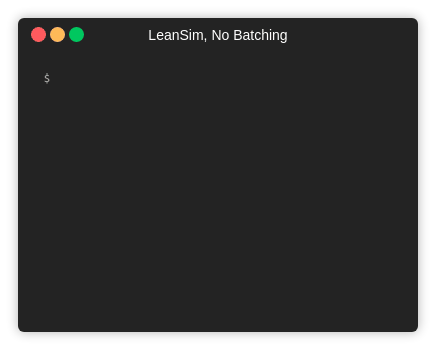

# LeanSim

[](https://travis-ci.org/nickdelgrosso/LeanSim)
[](https://coveralls.io/github/nickdelgrosso/LeanSim?branch=master)


## Installation

If Python is installed on your machine, it's simply:
```bash
pip install LeanSim
```

## Usage

### As a Command-Line Program

A simulation can be run easily from the command line. For a list of options:

```bash
 $ leansim --help
usage: leansim [-h] [--workers WORKERS] [--work WORK] [--duration DURATION]
               [--batch BATCH] [--sleep SLEEP] [--bottleneck BOTTLENECK]
               [--max_todo MAX_TODO] [--pull]

A simple Lean production simulation, meant for exploring lean management
concepts and sharing in a lecture setting.

optional arguments:
  -h, --help            show this help message and exit
  --workers WORKERS, -w WORKERS
                        Number of workers in value stream.
  --work WORK           Number of products to make.
  --duration DURATION   Number of time steps each process takes.
  --batch BATCH         Batch size for each worker.
  --sleep SLEEP         Time to sleep between steps.
  --bottleneck BOTTLENECK
                        Position of bottleneck. If 0, no bottleneck exists.
  --max_todo MAX_TODO   Maximum worker todo list size. Used for demonstrating
                        pull/kanban system
  --pull                Have workers pull, only accepting work if next worker
                        can take the output.

```
    
These will run a simple demo of the production system described, which is useful for explaining the concepts behind Lean and Kanban with others.

For example, the effects of different batch sizes.

Full Batching:


No Batching:



The effects of bottlenecks/constraints and how push systems differ in behavior from pull systems:

Push system:


Pull system:


### As a Python package

```python

```

More interesting arrangements can be built with the supplied classes. Individual Workers objects can be arranged in various networks
and individual behaviors:
 
```python
>>> from leansim import Worker
>>> w1 = Worker(batch_size=1, pull=False, capacity=1)
>>> w2 = Worker()
>>> w1.target = w2
>>> w1.todo = 5
>>> w1.work()
1
>>> w1.todo
4
>>> w1.done
1
>>> w1.push()
>>> w1.done
0
>>> w2.todo
1
```

These workers can be placed inside Workflows as well, to make it easier to run simulations.
```python
>>> from leansim import Worker, Workflow
>>> workers = [Worker(batch_size=20) for el in range(4)]
>>> for w1, w2 in zip(workers[:-1], workers[1:]):
>>>     w1.target = w2
>>> workflow = Workflow(workers=workers)
>>> workflow.process(work=20)
```

The simulation can be displayed with the 'verbose=True' option, as well:
```python
>>> workflow.process(work=20, verbose=True, sleep_time=0.2)
------------------------- LEAN SIM --------------------------------

  task_duration:	 1	 1	 1	 1
       capacity:	 1	 1	 1	 1
     batch_size:	 20	 20	 20	 20
       max_todo:	  	  	  	  
               :	---	---	---	---
           todo:	  	 40	 20	 20
          doing:	  	  	  	  
           done:	  	  	  	  
               :	---	---	---	---
            wip:	  	 40	 20	 20

-------------------------------------------------------------------
total_work: 80     wip: 80     
Steps: 41


```

I hope you enjoy using it!  

